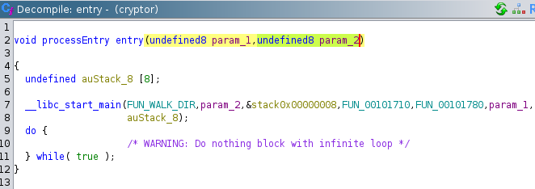
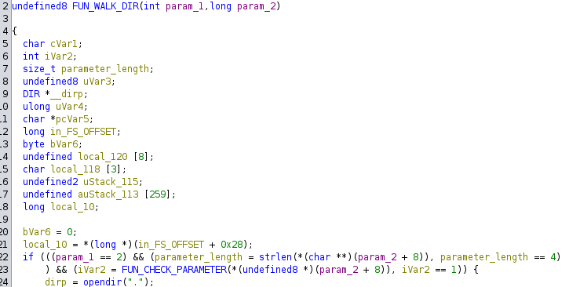
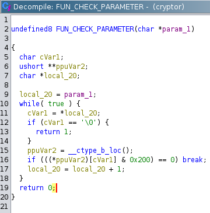
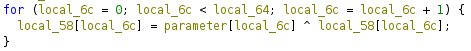
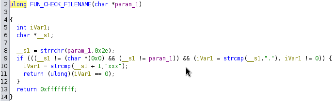

## Challenge Name: ENCRYPTED USB DRIVE

> Category: Reverse Engineering

> Difficulty: Moderate

> Points: 165

Challenge Description:

An important USB drive containing sensitive information has been encrypted by some new ransomware variant. Can you reverse the ransomware encryption function and recover the files?

### Approach

**1. Trying my Luck with Autopsy**

After reading "USB drive" and "recover the files" I instantly thought of Autopsy and tried my luck with it. But for some reason adding the USB image as a data source took forever and I followed a different approach in the meanwhile. I don't know if it would have worked with Autopsy, maybe I will try it in the future.

**2. Mounting the Image and using dislocker**

First step was to mount the image as a loop device so I could work with it.

```
┌──(orb1t4l㉿elysium)-[~]
└─$ sudo losetup /dev/loop1 ./encrypted_usb.dd

```

After some research I found the tool `dislocker`, which can read/write bitlocker encrypted partitions and also decrypt them. I also found this tutorial [How to decrypt bitlocker partition](https://std.rocks/gnulinux_bitlocker.html) on how to decrypt images with the recovery password.

The decrypted Bitlocker image will be saved here:

```console
┌──(orb1t4l㉿elysium)-[~]
└─$ sudo mkdir /media/encrypted_usb 
```

In order to brute-force the recovery keys, i wrote a little python script...

```python
import subprocess

keys_file = open("recovery_keys_dump.txt", "r")
keys = keys_file.readlines()

for key in keys:
    key = key.replace("\n", "")
    output = subprocess.run(['sudo', 'dislocker', '-V', '/dev/loop1', '-p'+key, '/media/encrypted_usb'], stdout=subprocess.PIPE).stdout.decode('utf-8')
    if output.find("Abort") == -1:
        print("Found Key: " + key)
```

... and voila!

```console
┌──(orb1t4l㉿elysium)-[~]
└─$ sudo python3 crack.py                     
Found Key: 334565-564641-129580-248655-292215-551991-326733-393679
┌──(orb1t4l㉿elysium)-[~]
└─$ sudo ls /media/encrypted_usb
dislocker-file
```

Before we can finally access the content of the usb, we need to mount the decrypted bitlocker image.

```console
┌──(orb1t4l㉿elysium)-[~]
└─$ sudo mkdir /mnt/bitlocker
                                                   
┌──(orb1t4l㉿elysium)-[~]
└─$ sudo mount -o loop /media/encrypted_usb/dislocker-file /mnt/bitlocker 
```

**3. Reversing the Ransomware Encryption**

And here comes the ransomware encryption :/

```
┌──(orb1t4l㉿elysium)-[~]
└─$ ls -la /mnt/bitlocker 
total 3257
drwxrwxrwx 1 root root    4096 Oct  8  2022 .
drwxr-xr-x 3 root root    4096 Jun  7 11:30 ..
-rwxrwxrwx 1 root root  484449 Oct  8  2022 crypto_passphrase.png.xxx.crypt
-rwxrwxrwx 1 root root   14360 Oct  8  2022 cryptor
-rwxrwxrwx 1 root root    9352 Oct  8  2022 do_not_open.png.xxx.crypt
-rwxrwxrwx 1 root root  135394 Oct  8  2022 meeting_minutes.png.xxx.crypt
-rwxrwxrwx 1 root root  909569 Oct  8  2022 passwords.png.xxx.crypt
-rwxrwxrwx 1 root root     386 Oct  8  2022 ransom.txt
-rwxrwxrwx 1 root root 1755677 Oct  8  2022 salary_screenshot.png.xxx.crypt
```

The `ransom.txt` says something about XOR, sounds promising. Lets take a look at `cryptor` with Ghidra.

When looking at the entry function, we can see, that cryptor, takes an additional parameter.



The parameter has to be a string and 4 characters long. It also has to pass an additional check of a function.



After some research and little bit help of ChatGPT, i finally managed to understand what the CHECK_Parameter function does.



The CHECK_Parameter returns 0 if any of the chars of the paramter is a whitespace character, so not very helpful.

The trace of the parameter leads to an functions which performs the encryption and where the parameter is used 
in a for-loop to perform XOR encryption.



To summarize what we have so far:
- The Cryptor binary takes an additional Parameter, which is used as the key
- The key is a string and has to be 4 characters long
- The key does not include any whitespace characters

Another thing, that I found out is, that the binary does no perform encrpytion on files, which already ".xxx" in their name.



A string with 4 characters and without any further limitations is still a little bit much to bruteforce.

I have to be honest, at this point I was pretty frustrated, because I was not sure if could narrow down the possible charset of the key or if was going in completely wrong direction.

After a while I started playing around ltrace and found something interesting...

`Cryptor` exits with 1, when no parameter is provided (as expected):

```
┌──(orb1t4l㉿elysium)-[/mnt/bitlocker]
└─$ ltrace ./cryptor    
+++ exited (status 1) +++
```

It also exits with 1, if the key is too short or too long:

```
┌──(orb1t4l㉿elysium)-[/mnt/bitlocker]
└─$ ltrace ./cryptor 111
+++ exited (status 1) +++
        
┌──(orb1t4l㉿elysium)-[/mnt/bitlocker]
└─$ ltrace ./cryptor 11111
+++ exited (status 1) +++
```

But why does it exit with 1, even with the right length?

```
┌──(orb1t4l㉿elysium)-[/mnt/bitlocker]
└─$ ltrace ./cryptor 1111 
+++ exited (status 1) +++
```

Let's play around with different charsets:

```
┌──(orb1t4l㉿elysium)-[/mnt/bitlocker]
└─$ ltrace ./cryptor AAAA
+++ exited (status 1) +++
      
┌──(orb1t4l㉿elysium)-[/mnt/bitlocker]
└─$ ltrace ./cryptor aaaa 
+++ exited (status 0) +++

┌──(orb1t4l㉿elysium)-[/mnt/bitlocker]
└─$ ltrace ./cryptor +%$#
+++ exited (status 1) +++

```

Exits with 0, when only lower-case letters are provided, very intersting. After playing around a little bit more, I was pretty sure, that the key has to be lower-case letter only.

**4. Time to write a brute-force script (again).**

To author of the challenge was kind enough, to give as a hint on how to find the correct key. The only encrypted files are PNG files, which have a clear file signature ([List of file signatures](https://en.wikipedia.org/wiki/List_of_file_signatures)).

This my final script, where the first part finds the correct key and the second part decrypts the file with the found key.

```
from itertools import product

def find_key():
    charset = "abcdefghijklmnopqrstuvwxyz"
    
    encrypted_file = open('/mnt/bitlocker/do_not_open.png.xxx.crypt', 'rb')

    first_8_encrypted_bytes = encrypted_file.read(8)

    # Generate all possible combinations of 4 lower-case letters
    for comb in product(charset, repeat=4):
        key = comb + comb

        dec_bytes = b''

        for i in range(8):
            dec_bytes += bytes([first_8_encrypted_bytes[i] ^ ord(key[i])])

        # Compare decrypted first 8 bytes with PNG file signature
        if dec_bytes == b'\x89\x50\x4E\x47\x0D\x0A\x1A\x0A':
            print("Found correct key: " + ''.join(comb))
            return ''.join(comb)
        
def decrypt_file(xorkey):
    file_content = bytearray()

    xorkey = xorkey.encode()
    encrypted_file_path = '/mnt/bitlocker/do_not_open.png.xxx.crypt'
    encrypted_file = open(encrypted_file_path, 'rb')

    for i, byte in enumerate(encrypted_file.read()):
        file_content.append(byte ^ xorkey[i % len(xorkey)])

    decrypted_file_path = encrypted_file_path[:-10]

    decrypted_file = open(decrypted_file_path, 'wb')
    decrypted_file.write(file_content)
    print("Saved decrypted file to " + decrypted_file_path)

key = find_key()
decrypt_file(key)
```