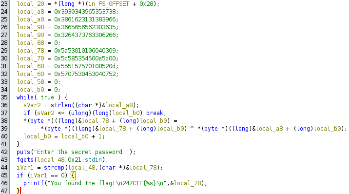
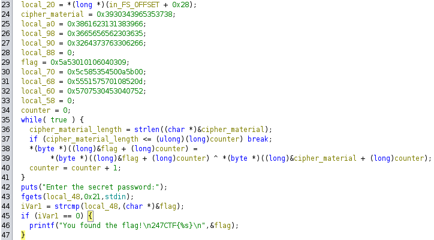

## Challenge Name: THE ENCRYPTED PASSWORD

> Category: Reverse Engineering

> Difficulty: Easy

> Points: 130

Challenge Description:

You won't find the admin's secret password in this binary. We even encrypted it with a secure one-time-pad. Can you still recover the password?

### Approach

**1. Basic Information Gathering**

Again, the binary file is a standard ELF. Strings shows, that the flag is built with a format string, but doesn't help us any further.

```console
┌──(orb1t4l㉿elysium)-[~]
└─$ strings encrypted_password | grep 247
247CTF{%s}
```

When executing the binary, we are promted for a password. Time to get the password.

```console
┌──(orb1t4l㉿elysium)-[~]
└─$ ./encrypted_password                           
Enter the secret password:
password
```

**2. Reversing the Binary with Ghidra**

After the opening the function, which prompts for the input, we see, that the flag is decrypted and used to compare the password.



I renamed some variable the make the process more clear.



With the renamed variables, it becomes clear, that the first while loop performs a XOR for every byte in the flag with the corresponding bytes in the cipher_material. But the really interesting thing is, that the flag is decrypted before the actual comparison takes place, so ltrace should do the thing.

```console
┌──(orb1t4l㉿elysium)-[~]
└─$ ltrace ./encrypted_password 
...
puts("Enter the secret password:"Enter the secret password:
)                                                                                                = 27
fgets(aa
"aa\n", 33, 0x7f9381a338e0)                                                                                                 = 0x7ffeb8543200
strcmp("aa\n", "141cXXXXXX"...)                          ...
```

And the we have our decrypted password. To check the password we run binary again, but this time with the decrypted password.

```
┌──(orb1t4l㉿elysium)-[~]
└─$ ./encrypted_password
Enter the secret password:
141cXXXXX
You found the flag!
247CTF{141cXXXXXX}
```