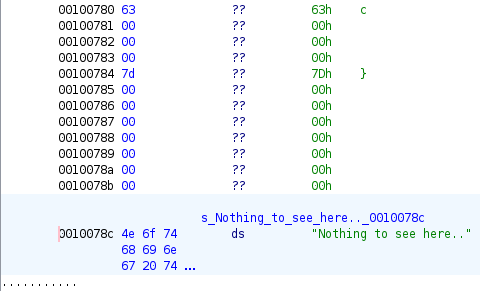
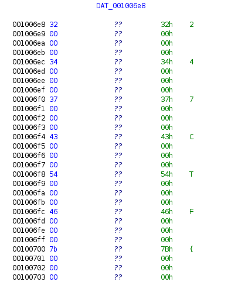

## Challenge Name: THE MORE THE MERRIER

> Category: Reverse Engineering

> Difficulty: Easy

> Points: 95

Challenge Description:

One byte is great. But what if you need more? Can you find the flag hidden in this binary?

### Approach

**1. Basic Information Gathering**

My first steps were (as always) to see what type of file the binary was und what ouput does it produce:

```console
┌──(orb1t4l㉿elysium)-[~]
└─$ file the_more_the_merrier
the_more_the_merrier: ELF 64-bit LSB pie executable, x86-64, version 1 (SYSV), dynamically linked, interpreter /lib64/ld-linux-x86-64.so.2, for GNU/Linux 3.2.0, BuildID[sha1]=0f750d638337391328fa7432dd362189de908c1e, stripped
```

```
┌──(orb1t4l㉿elysium)-[~]
└─$ ./the_more_the_merrier
Nothing to see here..
```

Strings did also not produce any valuable information, so now lets start reversing it.

**2. Reversing the Binary with Ghidra**

After looking at the program flow for a little bit too long (without any success) I searched for output string "Nothing to see her..".



At first I didn't notice anything, but wait what's that? There is a "}" above. After scrolling up a litle bit, if founde the flag.

