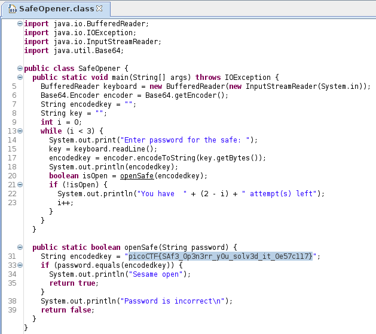

## Challenge Name: Safe Opener 2
Category: Reverse Engineering

Points: 100

Challenge Description:

What can you do with this file? I forgot the key to my safe but this file is supposed to help me with retrieving the lost key. Can you help me unlock my safe?

### Approach

**1. Finding a Decompiler for Java class files**

After some online research I found jd-gui for decompiling.

**2. Decompiling the class file**

You only need to open the .class file in jd-gui and the flag can be seen instantly.

